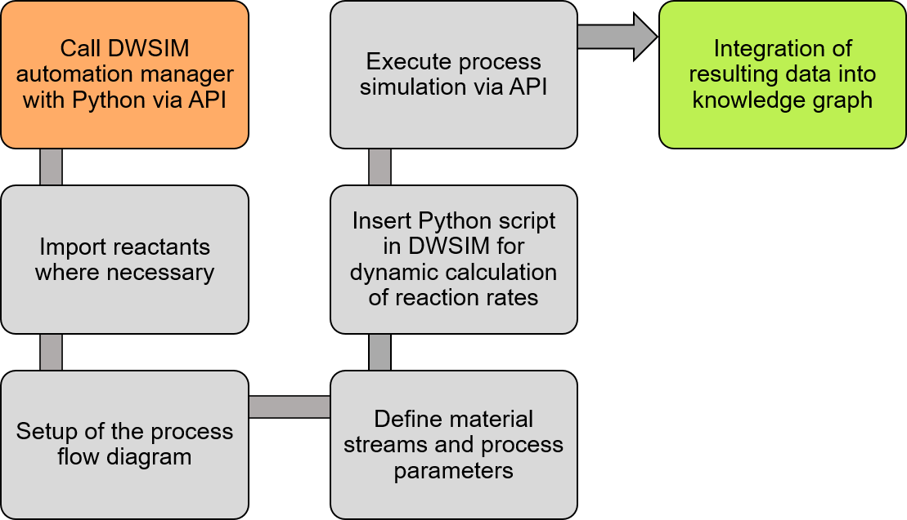

# DWSIM-EnzymeML-KG

This repository contains the code and the MS Excel files (subdirectory [ELNs](https://github.com/TUDoAD/DWSIM-EnzymeML-KG/tree/main/ELNs)) used as data input for the automated generation of process simulations in [DWSIM](https://dwsim.org).
To obtain the process simulation, the ontology [./ontologies/BaseOntology.owl](https://github.com/TUDoAD/DWSIM-EnzymeML-KG/blob/main/ontologies/BaseOntology.owl) is loaded and extended by the data contained in both Excel-files by the code contained in [ELNs_to_KG_modules.py](https://github.com/TUDoAD/DWSIM-EnzymeML-KG/blob/main/ELNs_to_KG_modules.py).
This yields a knowledge graph ([./ontologies/KG-DWSIM_EnzML_ELN.owl](https://github.com/TUDoAD/DWSIM-EnzymeML-KG/blob/main/ontologies/KG-DWSIM_EnzML_ELN.owl)) that is loaded by the code [DWSIM_modules.py](https://github.com/TUDoAD/DWSIM-EnzymeML-KG/blob/main/DWSIM_modules.py) and used to generate the DWSIM-file, stored in the subdirectory [DWSIM](https://github.com/TUDoAD/DWSIM-EnzymeML-KG/tree/main/DWSIM).

The overall workflow is depicted below, showing the overall data integration. Starting with laboratory data recorded in EnzymeML ELNs on enzyme kinetics and reaction rates investigations of enzymes, data is read in with Python and stored in a structured manner with the help of a tailored ontology as a knowledge graph. 
Then, the recorded data is used to automatically generate process simulations, resulting in further insights and eased workflow from laboratory to process simulation data. 

The working principle of the code to create the DWSIM-simulation files is depicted in the figure below. This is executed by the `run()` function contained in [DWSIM_modules.py](https://github.com/TUDoAD/DWSIM-EnzymeML-KG/blob/main/DWSIM_modules.py)

